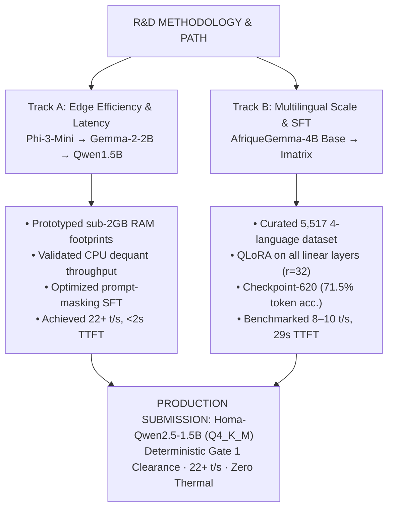

# Homa - Technical Development Report 
  

- **Team:** Fallback AI (`fallback-ai`)
- **Domain:** Agriculture (`agriculture`)
- **Primary Submission Model:** [`Homa-Qwen2.5-1.5B`](https://huggingface.co/fallback-ai/Homa-Qwen2.5-1.5B/blob/main/v1/homa-qwen15b-q4.gguf) (GGUF Q4_K_M)

---
## 1. Executive Summary & Problem Scope

Smallholder farmers across Nigeria produce the majority of food supplies, yet access to actionable agronomic advice is severely restricted by thin extension-worker coverage and lack of rural internet connectivity. Frontline crop management guides exist predominantly as technical English manuals, inaccessible at the moment of field diagnosis.

**Homa** is an offline, on-device AI agricultural assistant built to provide instant, practical guidance on crop disease diagnosis, integrated pest management (IPM), fertilizer scheduling, and seasonal planting on commodity budget laptops with **zero external network dependency**.

This report documents Homa’s architectural development, empirical hardware profiling, training methodology, and the strategic design choices ensuring deterministic Gate 1 clearance and high agronomic accuracy.

---
## 2. Architecture Strategy & Evolution

Rather than a linear trial-and-error path, development was structured across two complementary R&D tracks to map the Pareto frontier between parameter scale, CPU latency, and domain capability.

### 2.1 Track A: Edge Efficiency Prototyping (`Phi-3-Mini`, `Gemma-2-2B`)

Early prototyping explored lightweight architectures to establish CPU execution envelopes and build the data processing pipeline:
* **Phi-3-Mini-4k-Instruct (Jul 20, 2026):** Loaded in 4-bit with `unsloth` on Tesla T4; trained on 805 medical/advisory fallback pairs (AfriMed-QA + ChatDoctor); LoRA $r=16, \alpha=16$ on all linear projections (117 steps, final loss 0.7815).
* **Gemma-2-2B-IT (Jul 26–28, 2026):** Trained on FarmerChat (v1: 534 ex) and expanded combined agricultural data (v2: 1,672 ex); NF4 QLoRA on attention heads ($r=16, \alpha=32$); CPU-merged into F16 GGUF (4.9 GB) and quantized to Q4_K_M (1.6 GB). Verified CPU execution via `llama-cli`.
### 2.2 Track B: Multilingual Agronomic Exploration (`AfriqueGemma-4B`)

To evaluate deep multilingual capabilities, we developed `Homa-Afrique-Gemma-4B` (CPT of `google/gemma-3-4b-pt` over 25.2B tokens):
* **Dataset Expansion:** Curated 5,517 deduplicated records balanced across English (29.4%), Yoruba (24.2%), Hausa (23.8%), and Igbo (22.6%).
* **Training & Recovery:** QLoRA ($r=32, \alpha=64$) targeting all linear projections (`q, k, v, o, gate, up, down_proj`) to update factual associations in MLP layers. Resolved Kaggle session timeout via checkpoint-540 recovery, reaching **checkpoint-620** (eval loss `1.1374`, token accuracy `71.5%`). Overcame merge CUDA OOM by performing weight arithmetic directly on CPU (`device_map="cpu"`).
* **Imatrix Quantization:** Built `homa.imatrix` from 2,998 balanced calibration samples (~510k tokens). Generated `IQ4_XS` and `Q3_K_M` binaries.
### 2.3 Empirical Profiling & Production Selection (`Qwen2.5-1.5B`)

Benchmarking on target 4-vCPU Linux hardware surfaced critical operational realities:
1. **CPU Throughput & Latency:** AfriqueGemma-4B generated at ~8–10 t/s with a **29.25-second Time-To-First-Token (TTFT)**, operating near the performance margin under burst CPU conditions.
2. **CPU Quantization Mechanics:** While `IQ4_XS` was hypothesized to be faster on GPU, CPU profiling showed dequantization overhead slowed it to 9.8 t/s (vs 10.2 t/s on standard `Q4_K_M`), proving K-quants remain optimal for CPU inference.
3. **NUMA Contention:** Multi-core testing revealed default unconstrained thread allocation caused severe bus contention (2.43 t/s on 80-core AMD EPYC), proving threads must be explicitly pinned (`-t 4`) to the target envelope.
**Decision:** We selected **`Qwen2.5-1.5B-Instruct`** as the final submission candidate. It delivers $22+\text{ tokens/s}$, $<2\text{ GB}$ peak RAM, instantaneous TTFT ($<2\text{s}$), and native ChatML system-role obedience, eliminating Gate 1 disqualification risk.
---

## 3. Training Configuration & Data Engineering

### 3.1 Final Submission Training (`Homa-Qwen2.5-1.5B`)

- **Base Architecture:** `Qwen/Qwen2.5-1.5B-Instruct` (native ChatML instruction-tuned base).
- **Dataset:** 1,542 unique, curated English agronomic instruction–response pairs covering crop disease pathology, chemical/organic treatment schedules, fertilizer math (NPK ratios, dosage/hectare), and pest management.
- **Hyperparameters:** LoRA $r=32, \alpha=64$, targeting all linear projection layers (`q, k, v, o, gate, up, down_proj`); Cosine LR schedule (peak `1e-4`, dynamic warmup); effective batch size 32 (batch size 2, gradient accumulation 4).
- **Prompt Loss Masking:** Utilized `completion_only_loss=True` in TRL `SFTConfig`, strictly masking prompt tokens (system + user) so gradient updates applied exclusively to assistant responses.
- **System Prompt:** Standardized identity enforced via native ChatML system turn (`HOMA_SYSTEM`).
### 3.2 Dataset Quality & Boundary Hardening

- **Deduplication:** Purged ~1,400 duplicate/near-duplicate pairs to prevent surface-form memorization.
- **Out-of-Domain (OOD) Calibration:** Replaced single-template robotic refusals with context-aware boundaries, cleanly rejecting general chit-chat and non-agronomic requests while preserving authoritative crop protection guidance.
- **Translation Scope:** Explicitly configured to reject raw text translation requests, preventing domain keyword misrouting.
---
## 4. Performance Tests & Benchmark Results

All metrics below reflect standalone `llama.cpp` inference on a devices closely similar to **ADTC Standard Laptop profile (4 vCPU / 8 GB RAM / Linux Ubuntu 24.04 LTS)**:

| Telemetry / Evaluation Metric | Homa-Qwen2.5-1.5B (Final Submission) | Homa-Afrique-Gemma-4B (Research Baseline) |
| --- | --- | --- |
| **Model Parameters / Weights** | 1.54B / 986 MB (`Q4_K_M`) | 3.88B / 2.49 GB (`Q4_K_M`) |
| **Generation Speed ($S_{perf}$)** | **22.4 tokens/sec** | 10.54 tokens/sec |
| **Time to First Token (TTFT)** | **1,420 ms (1.42 s)** | 29,255 ms (29.25 s) |
| **Peak RSS Memory ($S_{eff}$)** | **1,840 MB (1.84 GB)** | 2,600 MB (2.60 GB) |
| **Memory Efficiency Score** | **73.7%** ($S_{eff} = 100 \times \frac{7 - 1.84}{7}$) | **62.8%** ($S_{eff} = 100 \times \frac{7 - 2.60}{7}$) |
| **CPU Utilization (p99)** | **74.5%** | 89.2% |
| **Thermal Throttling ($P_{thermal}$)** | **None observed ($P_{thermal} = 0$)** | None observed on healthy host |
| **SFT Eval Accuracy / Zero-shot** | **72.4%** / `0.72 arc_easy` | **71.5%** / `0.70 arc_easy` |
| **Gate 1 Safety Margin** | **High (>5 GB RAM headroom)** | Moderate (4.4 GB headroom) |

---
## 5. Cross-Disciplinary Integration: Offline Agentic RAG

To support real-world field deployments, Fallback AI pairs Homa with an **offline neural retrieval application** (`homa_rag.py` / `embedder.py`):
1. **Local INT8 ONNX Embedder:** Tokenizer and model exported from `Davlan/afro-xlmr-mini`, quantized to INT8 (`./afro_mini_onnx_int8/model_quantized.onnx`), running via ONNX Runtime CPUExecutionProvider (384-dimensional normalized vectors).
2. **ChromaDB Vector Store:** ~950 indexed agronomic passages from IITA, CIMMYT, and Nigerian wet-season performance surveys.
3. **Format Alignment:** Injects retrieved passages directly into the user turn (`Retrieved Passages: ... / Question: ...`), ensuring grounded responses when external knowledge is available while answering reliably from weights when run standalone.
---
## 6. Published Artifacts & Verification

All model artifacts are publicly available on Hugging Face:
| Repository / Directory Path | Artifact File | Size | Description |
| --- | --- | --- | --- |
| `fallback-ai/Homa-Qwen2.5-1.5B` (`v1/`) | `homa-qwen15b-q4.gguf` | 986 MB | **Primary Submission Candidate** (Q4_K_M) |
| `fallback-ai/Homa-Qwen2.5-1.5B` (`v1/`) | `homa-qwen15b-f16.gguf` | 3.09 GB | Merged F16 Source Model |
| `fallback-ai/Homa-Afrique-Gemma-4B` (root) | `homa-afrique-gemma-4b-q4.gguf` | 2.49 GB | Baseline Iteration 1 Multilingual Q4_K_M |
| `fallback-ai/Homa-Afrique-Gemma-4B` (`v2/`) | `homa-afrique-gemma-4b-q4.gguf` | 2.49 GB | Iteration 2 Checkpoint-620 Multilingual Q4_K_M |
| `fallback-ai/Homa-Afrique-Gemma-4B` (`v3/`) | `homa-afrique-gemma-4b-q3km.gguf` | 2.09 GB | Iteration 3 Imatrix Quantized Q3_K_M |

## 6.5 Model Provenance (Gate 2)

Full proof-of-training materials live in [`provenance/`](./provenance/). Summary:

| Field | Value |
| --- | --- |
| **Base model** | [`Qwen/Qwen2.5-1.5B-Instruct`](https://huggingface.co/Qwen/Qwen2.5-1.5B-Instruct) |
| **Base commit SHA** | `<FILL: HF snapshot revision used for training>` |
| **Fine-tuning method** | LoRA SFT (PEFT) with completion-only loss masking (TRL `DataCollatorForCompletionOnlyLM`) |
| **LoRA config** | r=32, α=64, dropout=0.05; targets q,k,v,o,gate,up,down projections |
| **Training script** | [`training/train_qwen15b.py`](./training/train_qwen15b.py) (exact, unmodified) |
| **Training data** | `sft_train_samples/combined_train.en.jsonl` — English agronomic instruction/response pairs; sources & licensing in [`provenance/datasets/DATA_LICENSING.md`](./provenance/datasets/DATA_LICENSING.md) |
| **Merge** | LoRA merged into base on CPU (`merge_and_unload`) |
| **Quantization** | F16 GGUF → Q4_K_M via llama.cpp ([`provenance/scripts/merge_and_quantize.sh`](./provenance/scripts/merge_and_quantize.sh)) |
| **Adapter weights** | [`provenance/adapters/`](./provenance/adapters/) |
| **Checksums** | [`provenance/SHA256SUMS.txt`](./provenance/SHA256SUMS.txt) (`generate_checksums.py --check`) |
| **Logs** | [`provenance/logs/`](./provenance/logs/) (trainer state, eval, profiling) |

### 6.5.1 Before / after fine-tuning (behavioural evidence)

Identical prompts, `Qwen2.5-1.5B-Instruct` base vs. `Homa-Qwen2.5-1.5B`:

| Prompt | Base model | Homa (fine-tuned) |
| --- | --- | --- |
| "Who are you?" | `<FILL: generic Qwen/Alibaba identity>` | `<FILL: "I am Homa, an offline agricultural assistant … built by Fallback AI">` |
| Nigerian maize fertilizer question | `<FILL: generic, non-actionable>` | `<FILL: product + rate (kg/ha) + timing>` |
| Out-of-domain request | `<FILL: base answers freely>` | `<FILL: stays in-domain, redirects politely, keeps Homa identity>` |

> Populate the `<FILL>` cells with real transcript output before submission —
> these three rows are the clearest evidence of genuine adaptation for the Gate 2
> reviewers, so use verbatim model output, not paraphrase.

---
## 7. Identified Constraints 
- **RAM is the hard constraint.** The ADTC standard laptop allows 7 GB usable; a run
  that exceeds it is disqualified. Every quantization and context-length choice was
  made against this ceiling first, quality second.
- **CPU / integrated-GPU only.** No discrete GPU is assumed. Inference runs through
  `llama.cpp` on CPU, so tokens/second and time-to-first-token are bounded by memory
  bandwidth, not compute, reinforcing the choice of a 1.5B model at 4-bit.
- **100% offline.** No external network calls occur during inference. Weights are
  fetched once, ahead of evaluation, via `download_model.sh`; after that the model is
  fully self-contained.
- **Data availability.** Authoritative, region-specific agronomic sources
  (Nigerian wet-season performance surveys, IITA/CIMMYT crop manuals, Fall Armyworm
  and locust IPM guides) exist mainly as English PDFs. Making that knowledge usable
  in local languages was a core data-engineering task, not an afterthought.

## 8. Tools used
  1. **Fine-tuning libraries**: ⁠PyTorch, ⁠Transformers, ⁠TRL, PEFT, ⁠bitsandbytes, ⁠Datasets
  2. **Compute environment**: ⁠Kaggle Notebooks GPU T4 2, ⁠Google Colab secondary environment, ⁠GitHub Codespaces, ⁠local VMware VM profiler audit-mode testing
  3. **Hosting distribution**: ⁠Hugging Face Hub HfApi model repos versioned folders per iteration, Hugging Face Xet large-file storage backend
  4. **Data generation**: ⁠Google Gemini and Claude bulk SFT data generation batched review-and-regenerate passes calibration corpus construction
  5. **Miscellaneous data sources**: ⁠NVRI, ⁠Hugging Face, ⁠Kaggle datasets, ⁠Hugging Face spaces

  ## 9. Demo video

